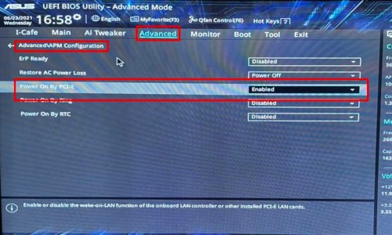

맥북 - 데스크탑

갤럭시 - 갤럭시워치

아이패드

의 조합을 사용하는 본인.

밖에서 데스크탑을 사용해야하는 경우에는 원격 제어 프로그램인 파섹 Parsec을 사용한다.

파섹으로 데탑을 이용하기 위해서는 데탑이 켜져 있어야하는데,

컴을 까먹고 꺼두고 나온 경우에는 파섹이 깔려 있더라도 데탑을 사용할 수 없었다.

때문에 Wol_Wake on LAN 기능을 설정해서 밖에서도 원격으로 컴을 켤 수 있는 기능을 설정했다...

사실 군 복무 기간동안 사지방에서 집에 데탑 사용하려다가 알게된 기능인데 참 유용하다 ㅎㅎ

WOL이랑 파섹 설정해두면 추석에 맥북만 가져가도 기숙사 데스크탑에 피파 틀어놓고 보상 받을 수 있다 개꿀ㅋㅋ

WOL 한줄 설명 :

이용자가 컴이 연결된 랜선의 외부 IP 주소로 접속해서, LAN선을 통해 컴을 깨우는 매직 패킷을 메인보드에 보내준다. 메인보드가 알아듣고 컴 켜준다.

참고 :

[https://opentutorials.org/course/3265/20033](https://opentutorials.org/course/3265/20033)

[

**공유기 (router) - 생활코딩**
공유기 (router) 2018-03-26 10:25:09 수업소개 집집마다 있는 공유기를 전문 용어로는 라우터라고 합니다. 라우터가 하는 일을 살펴봅니다. 그 과정에서 사설 아이피(private ip address)와 공용 아이피(pubilc ip address)의 차이점 또한 알게 됩니다. 강의 댓글을 작성하려면 로그인하셔야 합니다. toonfac 2개월 전 220704 오후 2시 완료 pmxsg 8개월 전 2022.01.14 수강 labis98 11개월 전 20210926 좋은 강의 감사합니다. chimhyangmoo 1년 전...

opentutorials.org

](https://opentutorials.org/course/3265/20033)

WOL 설정 방법 :

아주 잘 설명된 이거 그대로 따라하면 됨 ㅋㅋㅋ

[https://it.donga.com/32139/](https://it.donga.com/32139/)

[

**[IT하는법] 집 밖에서 원격으로 컴퓨터 켜기**
[IT동아 권택경 기자] 밤새 작업한 업무나 과제 파일을 깜빡하고 USB 메모리나 클라우드 저장 공간에 옮겨놓지 않았다면 어떻게 해야 할까? 시간 여유가 있다면 집으로 돌아가는 것

it.donga.com

](https://it.donga.com/32139/)
