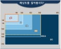
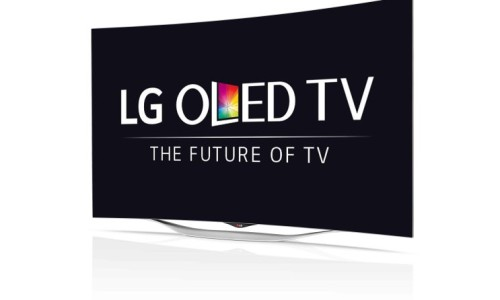

자꾸 다시 찾아보지 말고 한 방에 정리해두자구~

본인이 모니터 고르는 기준

- 화면 크기

- 주사율

- 해상도

- 응답속도

- 패널

- 인풋렉

**화면 크기**

컴퓨터용 모니터는 24인치, 27인치, 32인치 중에 고르자

24인치는 뭔가 조금 작고, 32인치는 책상 위에 올렸을 때 너무 큰 느낌 + 32인치면 왠지 돈 좀 주고 QHD로 골라야 할 것 같아서,,

지금까지 27인치만 써봄ㅋㅋㅋ

**주사율**

메인 모니터를 240Hz 로 사용하는 입장에서 맥북의 120Hz 주사율도 마우스 커서가 계속 끊기는 느낌이 든다 ..

최소 144Hz 이상, 주사율은 높으면 높을수록 좋은듯.

**해상도**

FHD(1920*1080) < QHD(2560*1440) < UHD(3840*2160) (4K)

*** WQHD 용어의 혼용에 대하여 ,, **

본래 qHD(960*540) 의 해상도가 있었기 때문에,

FHD -> QHD 가 생길때, 그냥 QHD가 아니라 WQHD라고 부름.

qHD는 이후 거의 안 쓰이기 때문에 시장에서 WQHD를 줄여서 QHD라고 부르게 되었는데,

이후 21:9 비율의 3440*1440 해상도를 WQHD라고 부르기 시작하면서

WQHD 라는 말이 혼용되기 시작함.

그니까 WQHD라고 하면 화면이 넓덕한 지 확인해서 알아서 (3440*1440) 인지 (2560*1440) 인지 판별합시다 .. 몇 년 전 제품을 보면 2440*1440이 WQHD라고 표기된 것들이 몇몇 있음.

4K는 데탑용 모니터에서는 쓸 생각이 전혀 없고, 언젠가 티비를 구매해야한다면 고려해볼 듯

14인치 맥북의 해상도가 QHD라 강제로 사용중이긴 한데, 확실히 FHD보다는 QHD가 좋은 것 같긴 함.

다만 항상 가격과의 타협이 문제인거지 ㅠ

**응답 속도**

가 항상 헷갈려서 자꾸 다시 찾아보게 되는데, 그러기 싫어서 이 글 적는 중

한 픽셀이 한 색을 켰다가 다음 색을 켤때까지 시간이 걸리는데, 이게 빠릿빠릿하지 못하면 잔상이 남게되서 빠르게 화면을 전환하는 fps 게임에서는 문제가 됨 . . .

잔상 테스트 사이트 1 : ufo

[https://www.testufo.com/ghosting](https://www.testufo.com/ghosting)

[

**TestUFO: Ghosting**
Animation on Blur Busters UFO Motion Tests for testing displays and monitors.

www.testufo.com

](https://www.testufo.com/ghosting)

잔상 테스트 사이트 2 : 적혀 있는 Q-52를 눈으로 읽을 수 있어야 함

[https://www.testufo.com/photo#photo=quebec.jpg&pps=480&pursuit=0&height=0](https://www.testufo.com/photo#photo=quebec.jpg&pps=480&pursuit=0&height=0)

[

**TestUFO: Photo**
Animation on Blur Busters UFO Motion Tests for testing displays and monitors.

www.testufo.com

](https://www.testufo.com/photo#photo=quebec.jpg&pps=480&pursuit=0&height=0)

다나와에서 모니터 스펙을 보다보면 응답속도 종류로는 GTG, MPRT, OD가 있음

제조사마다 다른 방식으로 응답속도를 측정하기 때문에 어떤 방법도 100% 신뢰할 수 있는 것은 아니지만 그나마 가장 정확한 것은 GTG 측정이라고 ..

- GTG : gray to gray

- MPRT 는 MBR 기술을 적용했을 때 측정되는 응답속도를 측정한 것.

MBR (Motion Blur Reduction) :

잔상이 남는 프레임에서 그냥 화면을 꺼버려서 잔상을 억제하는 기술인 듯 (내가 이해한 게 맞는지는 모름)

참고 : [https://coolenjoy.net/bbs/37/202092](https://coolenjoy.net/bbs/37/202092)

[

**쿨엔조이,쿨앤조이 coolenjoy, cooln, 쿨엔, 검은동네**
요즘 들어서 VA/IPS 1ms(MPRT/OD) 표시하는 제품들이 많아졌는데요. 최초로 1ms MPRT 얘기하는 거는 삼성 C24FG70 제품이고 이는

coolenjoy.net

](https://coolenjoy.net/bbs/37/202092)

그래서 MPRT 1ms 면 대충 GTG로는 4 ms 라고 함 ㅇㅇ

3. OD 모니터 성능 갉아먹는 오버드라이브를 시켰을 때 응답속도가 이만큼 나온다는 뜻

응답속도가 괜찮다면 굳이 이렇게 측정할 필요가 없을 테니, 굳이 OD(1ms) 라고 적힌 모니터는 대강 거르면 됨. (1ms 응답속도가 중요한 기준이라면)

예전에는 오버워치, 배그, 발로란트, 콜옵 등의 fps 를 많이 했어서 응답속도가 꽤 중요한 기준이었는데,

앞으로는 fps를 그만큼 열심히 할 것 같지는 않기 때문에 대충 GTG 5ms 또는 MPRT 1ms 미만이면 가격에 더 중점을 줘서 모니터를 고르지 않을까 하는 생각..이 드네요

**패널**

요것도 맨날 까먹어서 다시 찾아보는데, 그냥 한방에 정리해두려함.

크게 TN, VA, IPS 패널이 있고,

응답 속도 : TN > IPS > VA (순으로 좋음, TN이 제일 빠릿하다는 뜻)

명암비 : VA > IPS > TN

시야각 : IPS > VA >> TN(극악)

TN : 응답 속도만 빠르고 색도 흐릿하고, 시야각도 별로임 (비교적 싼 가격에 fps용을 원한다면 고르면 됨. 그래서 내가 240hz에 GTG 1ms 를 샀었지 ㅋㅋ ㅜ)

IPS : 시야각 좋음, 색재현 뛰어남, 응답 속도 준수, 빛샘 현상 발생

VA : 시야각 준수, 명암비 높음, 응답 속도 낮음, 빛샘 현상 발생 가능성, 커브드 용으로도 좋지만 충격에 약함

[https://blog.naver.com/PostView.nhn?blogId=zenoms&logNo=220956075822&proxyReferer=https:%2F%2Fwww.google.com%2F](https://blog.naver.com/PostView.nhn?blogId=zenoms&logNo=220956075822&proxyReferer=https:%2F%2Fwww.google.com%2F)

[

**LCD 모니터 패널의 종류와 특징 총정리(TN, VA, PVA, IPS)**
크리에이티브 커먼즈 라이선스이 저작물은 크리에이티브 커먼즈 코리아 저작자표시-비영리-변경금지 2.0 대...

blog.naver.com

](https://blog.naver.com/PostView.nhn?blogId=zenoms&logNo=220956075822&proxyReferer=https:%2F%2Fwww.google.com%2F)

**인풋렉**

나무위키 왈 : 모니터는 10ms 이하, tv나 빔프로젝터의 경우 100ms 이상일수도 있다고 함.

애초에 모니터의 인풋렉 정보는 제조사에서 정확히 제공하지도 않는 듯.

그냥 싼 게 비지떡이라 생각해야할 듯
