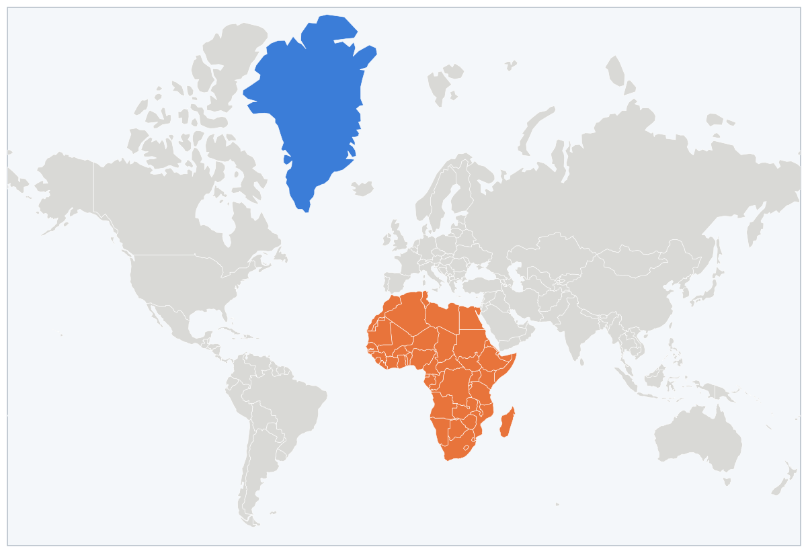
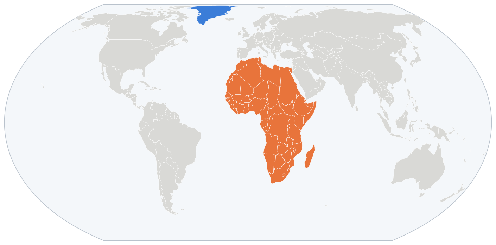

얼마 전 유엔 총회에서 세계지도 관련 결의안이 통과됐다. 아프리카 54개국이 같이 낸 안인데, 교과서나 언론에서 대륙 크기를 비교할 땐 면적이 정확한 지도, 특히 **이퀄 어스(Equal Earth)** 도법을 쓰자는 내용이다. 찬성 164, 반대 1(미국), 기권 6. 강제는 아니고 권고.

겨냥한 건 우리가 평생 본 그 지도, 메르카토르다. 위로 갈수록 땅을 늘려 그려서 그린란드가 아프리카만 해 보이는데, 실제로는 아프리카가 14배 크다. 면적이 맞는 이퀄 어스로 그리면 이렇다.

*위가 메르카토르, 아래가 이퀄 어스. 파란 게 그린란드, 주황이 아프리카.*

---

## 근데 진짜 지도 때문일까

캠페인 논리는 이렇다. 메르카토르가 아프리카를 작게 그림 → 사람들이 아프리카를 작게 기억함 → 그래서 덜 중요하게 여김.

첫 번째는 맞다. 근데 두 번째가 좀 수상하다. 실제로 학자들이 이걸 실험해 봤는데, 13만 명 넘게 참가한 연구에서 어떤 지도를 보고 자랐든 나라 크기 추정은 비슷하게 나왔다. 메르카토르 보고 자란 사람이 특별히 아프리카를 더 작게 생각하진 않았다는 거다. 다른 연구들도 결론은 비슷했다.

그런데 또 웃긴 건, 사람들한테 기억만으로 세계지도를 그리게 하면 아프리카는 작게, 유럽은 크게 그린다는 거다. 아프리카 학생들조차 그랬다. 지도 탓이 아니라면 이건 뭘까.

간단한 테스트 하나. 유럽 나라 10개 대 보자.

프랑스, 독일, 영국, 이탈리아, 스페인, 네덜란드, 스위스, 스웨덴, 노르웨이, 포르투갈. 10초 컷.

아프리카 나라 10개. 이집트, 남아공, 케냐, 나이지리아... 나는 네다섯 개에서 벌써 막힌다. 나라가 54개나 있는데.

이게 답이라고 본다. 사람들이 아프리카가 얼마나 큰지 체감 못 하는 건 지도가 잘못 그려져서라기보다, 그냥 관심이 없고 중요하다고 안 느껴서다. 머릿속 지도는 크기가 아니라 아는 걸로 채워진다. 아는 나라가 많은 유럽은 자리가 모자라서 커지고, 아는 게 없는 아프리카는 작게 그리고 끝난다. 실제로 중요하다고 생각하는 나라일수록 크게 그린다는 연구도 있다. 인지도의 문제고 관심의 영역이다.

---

## 그래서

이번 결의가 의미 없다는 건 아니다. 교과서 지도가 바뀌면 적어도 그린란드가 아프리카만 하다는 착각은 덜 하겠지.

근데 지도 면적 고친다고 사람들 머릿속 아프리카가 커질 것 같진 않다. 따지고 보면 이번 결의도 그렇다. 70년대에도 똑같은 주장(페터스 지도)이 있었는데 그땐 아무것도 안 바뀌었다. 아프리카에 대한 세상의 시선이 그때보다 달라졌으니까 이번엔 164개국이 손을 든 거다.

**지도가 바뀌어서 인식이 바뀌는 게 아니라, 인식이 바뀌어야 지도가 바뀐다.**
